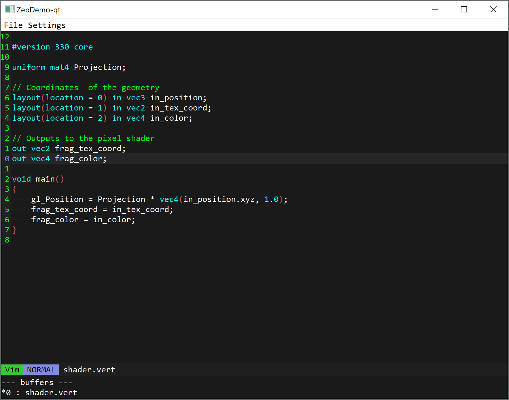
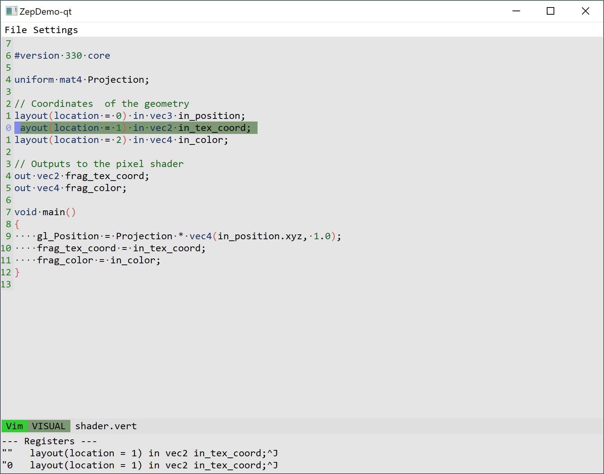

[Zep](https://github.com/cmaughan/zep) - A Mini Editor
===================================================================================================

[](https://travis-ci.org/cmaughan/zep)
[](https://ci.appveyor.com/project/cmaughan/zep)
[](https://codecov.io/gh/cmaughan/zep)
[](https://github.com/cmaughan/zep/blob/master/LICENSE)

Zep is a simple embeddable editor, with a rendering agnostic design and optional Vim mode.  Out of the box it can draw to a Qt Widget
or an an ImGui window - useful for embedding in a game engine.  A simple syntax highlighting engine is provided, and can easily be extended. 
Basic theming support is also included, and window tabs and splits are in the works.  Zep is 'opinionated' in how it does things, but is easy to
modify and supports many common features

Zep supports the standard editing keystrokes you'll find in most editors, along with a reasonable subset of modal Vim editing, as an option.
Zep is not meant to replace Vim.  I don't have a lifetime spare to write that, but it has most of the functionality I use day to day, and 
anything missing will be added over time.

Zep is ideally suited to embedding in a game engine, as an in-game editor, or anywhere you need a simple editor without a massive dependency 
on something more substantial like NeoVim.  The core library is dependency free, small, and requires only a modern C++ compiler.
The demos for Qt and ImGui require their additional packages, but the core library is easily built and cross platform.  The ImGui demo builds and runs on Windows, Linux and
Mac OS.

Key Features:
* Modal 'vim' or modeless 'standard' editing styles.
* Terminal-style text wrapping, as an option
* Splits and tabs
* Qt or ImGui rendering (and extensible) 
* A simple syntax highlighting engine, with pluggable secondary highlighters
* Theme support
* No dependencies, cross platform, small library

Limitations:
* Zep currently ignores tabs and converts them to spaces, and internally works with \n. It will restore \r\n on save if necessary.
* Utf8 is not supported, and may not be, though the code has some placeholders for it as a future possibility

Though I have limited time to work on Zep, I do try to move it forward.  Currently I hope it is functional/stable enough to be used.
There are over 100 unit tests for the Vim mode, and more on the way for the 'notepad'-like editing mode.  This project started mainly as an experiment, and a learning exercise.  I like the idea of a programmer building programmer tools for their own use, 
just as carpenters used to build their toolbox.

Pull requests are appreciated and encouraged ;) 

Screenshot
----------
Using the ImGui Renderer:


Using the Qt Renderer:


A light theme:


Embedded in a Game Engine:


Design
------

##### Buffer
The editor is built around a core buffer object which manages text.  Underneath it all is a 'gap buffer' structure which enables fast
manipulation of text.  The buffer layer just manages text and finds line-ends.  That's all it is intended to do.  Since it is a 
simple/tested layer, it ensures that the buffer is never corrupted by outside layers.

##### Commands
On top of the thin buffer layer, is a command layer for inserting and removing strings.  This knows how to add and remove text in the buffer, 
and implements undo/redo functionality.

##### Window
The window layer manages views onto buffers.  It helps with cursor operations, and enables multiple views of the same or multiple buffers.
Since selections are window specific due to wrapped text, such things are done relative to windows, not buffers.
Most of the buffer/tab management is architected, but not yet enabled.  Support for Tabs and Splits is planned.

##### Display
A simple display layer is used to render buffers into a window.  It has a thin backend for drawing to the screen, requiring just a few simple
functions to draw & measure text, and draw rectangles and lines.  It is this layer which can be specialized to draw with windows or Qt for
example.  It took just an hour or so to add Qt support.  The rest of the display code is not rendering specific.  The display layer can manage
simple layout of the editor; adding tabs, arranging split windows, showing the 'airline' like status bar, showing command mode operations such
as ':reg' and ':ls', etc. 

##### Vim & Standard Modes
Mode plugins provide the editing facility - currently that is Vim & Standard.
The Vim mode has most of the usual word motions, visual mode, etc.  The standard mode has the usual shift, select, cut/copy/paste, etc.
See [Vim Mode](https://github.com/cmaughan/zep/wiki/Vim-Mode), or the top of the mode_vim.cpp file for a list of supported operations.

##### Syntax highlight
Syntax plugins scan and update the color information for the display layer, and enable syntax highlighting.  The syntax layer runs in
a thread, collecting buffer updates and generating a color attribute list for the display layer.  It is a work in progress to make this
more general.  Currently there is a simple OpenGL highlight mode, which will likely become a base class for standard tokenized highlighting.
There is also a 'rainbow brackets' adornment plugin which works with any syntax mode.

##### Design goals
- A simple rendering layer, making the editor work on ImGui, Qt, or whatever.
- A useful notepad/vim alternative
- Support basic Vim commands I use every day.
- Something that works well inside a live shader editor/game editor, etc.  i.e. the kinds of tools I'm interested in.
- A learning tool.

Building
---------
You can follow the build buttons above to see build scripts, but the process is fairly simple:

##### Install Packages  
If you don't have them already, the following packages are required, depending on your system.  Note, that SDL is part of the build,
and not installed seperately.  It is only used for the demo, not the core editor library or unit tests. Qt is required to build the Qt demo on linux.
If you have compilation problems, you might need to investigate the compiler you are using.
Ubuntu 16 & 17 both have a recent enough version for it to work.  On Ubuntu 14 I tend to upgrade to g++6
The Qt app builds on linux, but is not part of the travis setup yet.

###### Linux
```
sudo apt install cmake  
sudo apt install git  
sudo apt install qt-default (for Qt support)
```

###### Mac
```
brew install cmake
brew install git
```
(If in doubt, see the .travis.yml build file for how the remote build machines are setup)

##### Get the Source
git clone https://github.com/cmaughan/zep zep  
cd zep  

##### Make
There are some sample scripts which call CMake, but you can generate makefiles for your favourite compiler by passing a different generator to it.

###### Linux 
```
./config.sh
make
```  

###### Mac (XCode)
```
./config_mac.sh
cd build
cmake --build .
```
###### PC
For ImGui:
```
config.bat
```
For Qt:
``` 
set QT_INSTALL_LOCATION=C:\Qt\5.10.0\msvc2017_64 (for example)
config_all.bat
```
For Both:
``` 
cd build
cmake --build .
(Or load solution in VC 2017)
```

##### Tests
Type `CTest --verbose` in the build folder to run unit tests.

Libraries
-----------
This sample uses SDL for the window setup, and ImGui for the rendering, or Qt.

[SDL2: Media/Window Layer](https://www.libsdl.org/download-2.0.php)  
SDL2 is used to get a window on the screen in a cross platform way, and for OpenGL to generate a Context.

[ImGui: 2D GUI](https://github.com/ocornut/imgui)  
ImGui is a great 2D User interface for 3D applications

