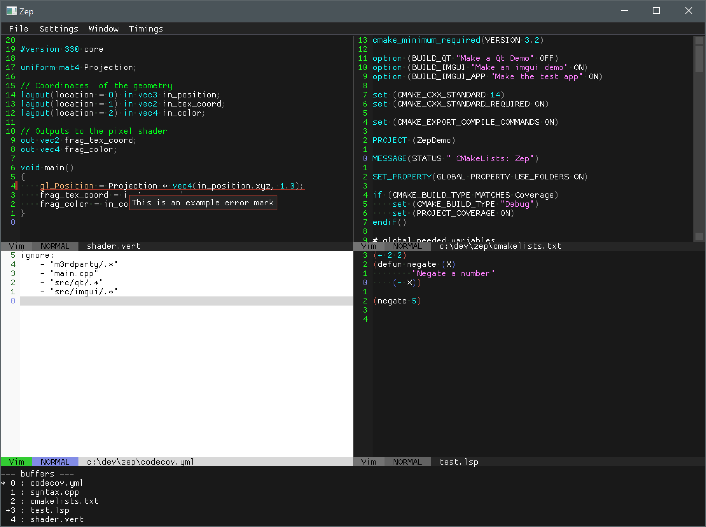

[Zep](https://github.com/cmaughan/zep) - A Mini Editor
===================================================================================================

[](https://travis-ci.org/cmaughan/zep)
[](https://ci.appveyor.com/project/cmaughan/zep)
[](https://codecov.io/gh/cmaughan/zep)
[](https://github.com/cmaughan/zep/blob/master/LICENSE)

A work in progress embeddable editor, designed for use inside ImGui, but can be used anywhere there is a display backend.  My original intent here was to learn about how text editors work and hopefully enhance my knowledge of Vim; along with provide an editor for a future shader editing app, for teaching at York Code Dojo.
This work is not finished, but I'm putting it out there on github for future attention ;)  It is not suitable for use as a general editor yet, even as a replacement for notepad, but it may get there one day.
The usual CI and unit test setup is done, and it builds on Win/Linux/Mac.

Design
------

##### Buffer
The editor is built around a core buffer object which manages test.  Underneath it all is a 'gap buffer' structure which enables fast manipulation of text.  The buffer layer just manages text and finds line-ends.  That's all it is intended to do.  Since it is a simple/tested layer, it ensures that the buffer is never corrupted by outside layers.

##### Commands
On top of the thin buffer layer, is a command layer for inserting and removing strings.  This knows how to add and remove text in the buffer.

##### Display
A simple display layer is used to render buffers into a window.  It has a thin backend for drawing to the screen, requiring just a few simple functions to draw & measure text, and draw rectangles and lines.  It is this layer which can be specialized to draw with windows or Qt for example.  The rest of the display code is not rendering specific.
The display layer can manage simple layout of the editor; adding tabs, arranging split windows, showing the 'airline' like status bar, showing command mode operations such as ':reg' and ':ls', etc.  Most of the buffer/tab management is not done.

##### Vim & Standard Modes
Mode plugins provide the editing facility - currently that is Vim, but I intend to add a much simpler 'standard' editing mode.  The Vim plugin supports common editing operations, and I'll add more as I get time.  It doesn't have vimscript or anything fancy like that - just simple motions and editing commands, along with visual mode for cut & paste, etc.
See [Vim Mode](https://github.com/cmaughan/zep/wiki/Vim-Mode)

##### Syntax highlight
Syntax plugins scan and update the color information for the display layer, and enable syntax highlighting.  The syntax layer is runs in a thread, collecting buffer updates and generating a color buffer for the display layer.

There are some unit tests, to be expanded for the various buffer and mode operations.
The demo uses SDL and ImGui to draw the editor.

##### Design goals
- Threaded syntax highlighting, using a simple highlighter class.
- Threaded reading of large files, with instant startup/display
- A simple rendering layer, making the editor work on ImGui, Qt, or whatever.
- A useful notepad/vim alternative
- Modes for Vim and Standard.
- Support basic Vim commands I use every day.
- A small kernel that actually manipulates the text using a Gap Buffer

##### Non Goals
- No unicode.  I've tried to keep things ready for utf-8, but may not get there.
- No international character sets
- No variable typeface support.  It's more like a terminal view where the grid of chars is constant

Screenshot
----------



Building
---------
You can follow the build buttons above to see build scripts, but the process is fairly simple:

##### Install Packages  
If you don't have them already, the following packages are required, depending on your system.  Note, that SDL is part of the build,
and not installed seperately.  It is only used for the demo, not the core editor library or unit tests.
If you have compilation problems, you might need to investigate the compiler you are using.
Ubuntu 16 & 17 both have a recent enough version for it to work.  On Ubuntu 14 I tend to upgrade to g++6

###### Linux
```
sudo apt install cmake  
sudo apt install git  
```

###### Mac
```
brew install cmake
brew install git
```
(If in doubt, see the .travis.yml build file for how the remote build machines are setup)

##### Get the Source
git clone https://github.com/cmaughan/zep zep  
cd zep  

##### Make
There are some sample scripts which call CMake, but you can generate makefiles for your favourite compiler by passing a different generator to it.

###### Linux 
```
./config.sh
make
```  

###### Mac (XCode)
```
./config_mac.sh
cd build
cmake --build .
```
###### PC
```
config.bat
cd build
cmake --build .
(Or load solution in VC 2017)
```

##### Tests
Type `CTest --verbose` in the build folder to run unit tests.

Libraries
-----------
This sample uses SDL for the window setup, and ImGui for the rendering.

[SDL2: Media/Window Layer](https://www.libsdl.org/download-2.0.php)  
SDL2 is used to get a window on the screen in a cross platform way, and for OpenGL to generate a Context.

[ImGui: 2D GUI](https://github.com/ocornut/imgui)  
ImGui is a great 2D User interface for 3D applications

